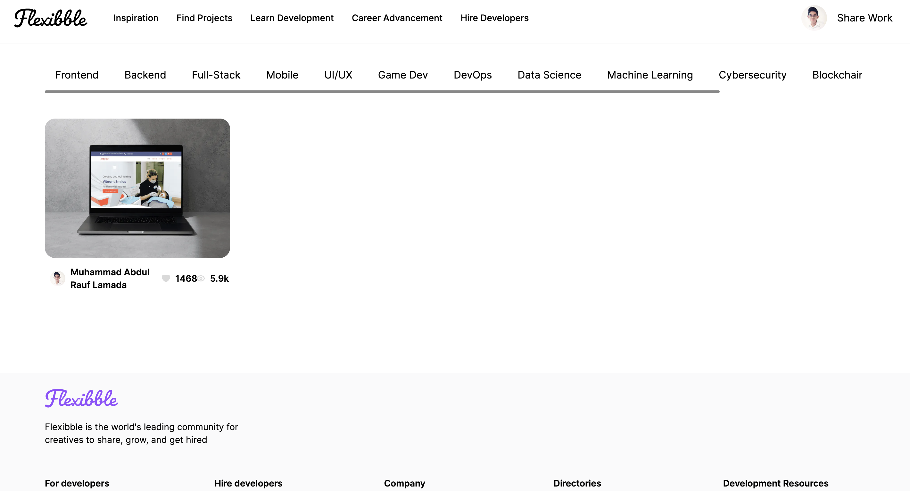

<h1>Flexibble</h1>

This is a wep app to show where user can upload their personal project as portfolio whether frontend project, backend, full-stack or mobile app. This web application is built with NextJs 13 with Typescript

<h2>Database</h2>
<ul>
  <li>Graphql</li>
  <li>Grafbase: to deploy the database <a href="https://grafbase.com/">link to grafbase</a></li>
  <li>Cloudinary: to save image</li>
</ul>

<h2>Authentication</h2>

Using google auth

<h2>Demo app</h2>
<a href="https://port-flexibble.vercel.app/">Flexibble</a>
